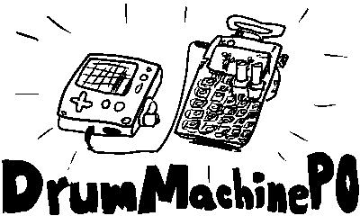
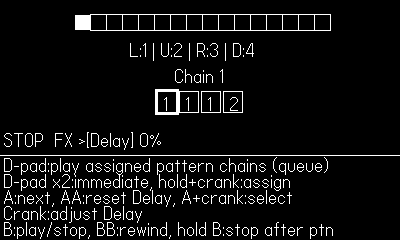

**DrumMachinePO**

A simple 16-step sequencer with multi-pattern chaining and Teenage Engineering Pocket Operator sync ability.

**Youtube demo video: https://youtu.be/MFBodQwCgpo?si=e0k65MqldogNP85w**

DrumMachinePO is an enhanced version of Playdate SDK example - DrumMachine - which is just a single-pattern 16-step sequencer. 

It adds the following features on top of the DrumMachine example:
1. Save/Load project
2. Multi-pattern (up to 18). 
3. Pattern chaining (up to 12 different pattern chains).
4. BPM/Swing adjustment 
5. Pocket Operator (e.g. PO-33 KO!) sync ability.
6. User-defined samples (instead of built-in sounds, must be done while connected to PC)

**How to install**

Download the "drummachinepo.pdx" folder or "drummachinepo.pdx.zip" file, then sideload it into the Playdate console. 

Use https://play.date/account/sideload/ page for zip file, and use usb connection to sideload the program directly to Games folder.

**Grid view - Pattern editor**

Control info:

D-PAD: Move around the grid. 

A: Add/remove note. Hold A+up/down to adjust velocity of each notes. If the focus is on the track name (e.g. "KickDrum"), the A-button press will mute the selected track.

B: Start/Stop playing. Double-tapping B while it's playing makes the play head go all the way to the first position.

Crank: 
- No modifier: change the pattern
- Hold A + crank: change BPM
- Hold B + crank: change Swing amount

**Patterns/Settings view**

You can access the patterns/settings menu via Playdate System menu.

Control info:

D-PAD: Move around the settings. 

A: Select options, or hold to copy pattern (cursor should be on the source pattern. While holding A, press left/right to desired destination patterns)

B: Go back to grid view, or hold to clear pattern/delete the pattern chain.

**Performance mode**

In "performance mode", you can play each "pattern chains" that is assigned to each directions of the D-pad.

Control info:

D-PAD: 
- Tap: Play the currently assigned pattern chain (queue to the pattern end). 
- Double Tap: Play the assigned pattern immediately
- Hold Direction+Crank: Change the assigned pattern chain 

A: Cycle through "effects". Only BPM/Swing for now (To be added)

B: Start/Stop playing, Double-tap to go all the way back.

**Using user samples**

DrumMachinPO looks for the user sample files when starting up. 

Put sample files in Shared/DrumMachinePO/Samples folder to use it instead of the built-in ones.

Sample names should match the ones in the following list (+ extensions. wav/aiff/mp3 are supported).

'KickDrum', 'SnareDrum', 'HHClosed', 'HHOpen', 'TomHi', 'TomMid', 'TomLow', 'Clap', 'Clav', 'Rimshot', 'Cowbell', 'Maraca', 'CongaHi', 'CongaMid', 'CongaLow'

**Syncing with Pocket Operator**

When Sync mode is enabled, DrumMachinePO shifts all the drum sounds to the right channel. 

Left channel is reserved for sync signal, which is just a click sound that fires 1,3,5,7... steps.

This is equivalent of Pocket Operator sync mode 1. (SY1)

Since there are no "stereo in" in Playdate, Playdate should be the first one in the chain.

You can access the Sync mode by holding "Function" key and pressing "BPM" key on your Pocket Operator.

Sync mode of Pocket Operators work like the following (from https://www.reddit.com/r/pocketoperators/comments/4h3l8k/sync_modes_explained/):

mode  input  output

SY0	  stereo  stereo

**SY1  stereo  mono/sync** --> Playdate runs in this mode

SY2  sync  stereo

SY3  sync  mono/sync

**SY4  mono/sync  stereo** --> Pocket Operator should be in this mode, **if it's the last one** in the Sync Chain.

**SY5  mono/sync  mono/sync** --> Pocket Operator should be in this mode, **if it's in the middle** of the Sync Chain.

As the sync signal is just a mono sound, if the volume is too low it might not get detected by the Pocket Operators.

Also, SY4/SY5 only appears when you ​connect the line-in cable to the PO.

**License info**

Original SDK example of DrumMachine was distributed in 0BSD license. 
This project - DrumMachinePO - is distributed under MIT license. 
