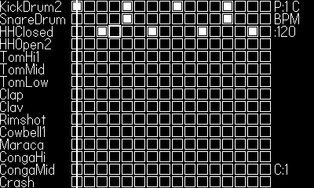
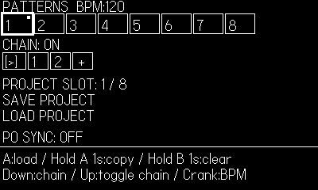

**DrumMachinePO**

Simple 16-step sequencer with multi-pattern chaining and Teenage Engineering Pocket Operator sync ability.

DrumMachinePO is an enhanced version of Playdate SDK example - DrumMachine - which is just a single-pattern 16-step sequencer. 

It adds the following features on top of the DrumMachine example:
1. Save/Load project
2. Multi-pattern (up to 8). 
3. Pattern chaining.
4. BPM/Swing adjustment 
5. Pocket Operator (e.g. PO-33 KO!) sync ability.

**How to install**

Download the "drummachinepo.pdx" folder or "drummachinepo.pdx.zip" file, then sideload it into the Playdate console. 

Use https://play.date/account/sideload/ page for zip file, and use usb connection to sideload the program directly to Games folder.

**Grid view - Pattern editor**

Control info:

D-PAD: Move around the grid. 

A: Add/remove note. Hold A+up/down to adjust velocity of each notes. If the focus is on the track name (e.g. "KickDrum"), the A-button press will mute the selected track.

B: Start/Stop playing.

Crank: 
- No modifier: change the pattern
- Hold A + crank: change BPM
- Hold B + crank: change Swing amount

**Patterns/Settings view**

You can access the patterns/settings menu via Playdate System menu.

Control info:

D-PAD: Move around the settings. "up" toggles the chain mode on/off when the highlight is at the top.

A: Select options, or hold to copy pattern (cursor should be on the source pattern. While holding A, press left/right to desired destination patterns)

B: Go back to grid view/delete the pattern chain, or hold to clear pattern.

**Syncing with Pocket Operator**

When Sync mode enabled, DrumMachinePO shifts all the drum sounds to the right channel. 

Left channel is reserved for sync signal, which is just a click sound that fires 1,3,5,7... steps.

This is equivalent of Pocket Operator sync mode 2. (SY2)

Since there are no "stereo in" in Playdate, Playdate should be the first one in the chain.

Sync mode of Pocket Operators work like the following (from https://www.reddit.com/r/pocketoperators/comments/4h3l8k/sync_modes_explained/):

mode	input	output
SY0	stereo	stereo
SY1	stereo	mono/sync
**SY2	sync	stereo** --> Playdate runs in this mode
SY3	sync	mono/sync
**SY4	mono/sync	stereo** --> Pocket Operator should be in this mode, **if it's the last one** in the Sync Chain.
**SY5	mono/sync	mono/sync** --> Pocket Operator should be in this mode, **if it's in the middle** of the Sync Chain.

As the sync signal is just a mono sound, if the volume is too low it might not get detected by the Pocket Operators.

**License info**

Original SDK example of DrumMachine was distributed in 0BSD license. 
This project - DrumMachinePO - is distributed under MIT license. 
